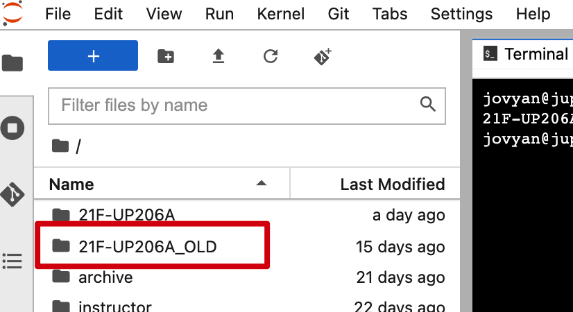
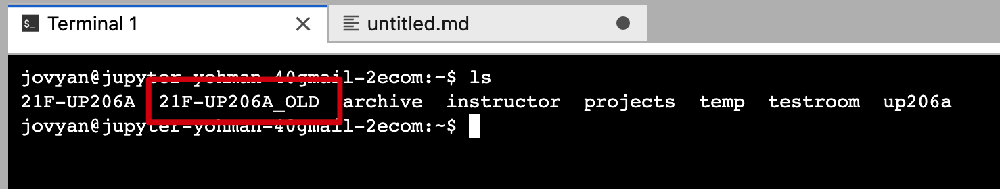

# How to delete a folder on JupyterHub (Use with CAUTION)

You may have noticed that you are unable to delete a folder that has files in it in your JupyterHub space. You can use the following guide to delete an entire folder using terminal commands. Use this guide with caution, as command line deletions are permanent.

Folder to delete

<kbd></kbd>

Launch a terminal window

<kbd></kbd>

Type `ls` and make sure the folder you want to delete is listed

<kbd></kbd>

Type the following command to delete the `21F-UP206A_OLD` folder and all its contents. This command is irreversible so double check your command before hitting enter:

```bash
rm -rf 21F-UP206A_OLD
```